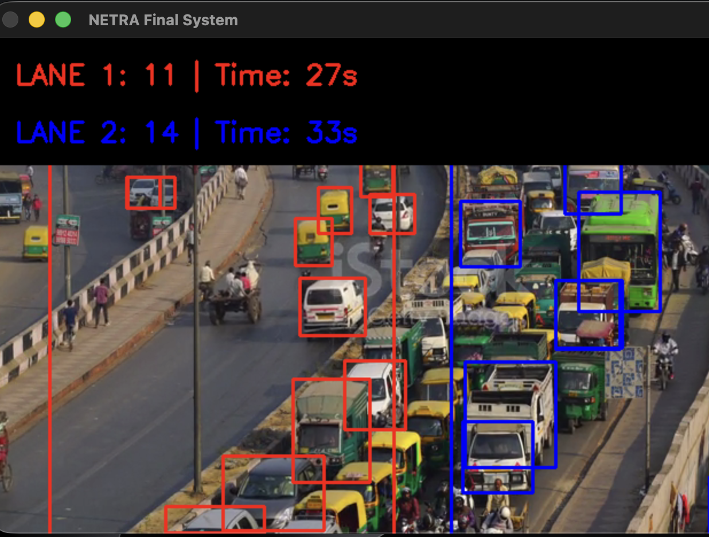

# 🚦 Project NETRA (Network Enabled Traffic Regulation & Analysis)

**An Intelligent Traffic Management System using Computer Vision & Deep Learning**

Project NETRA addresses the critical issue of urban traffic congestion and delayed emergency services. Unlike traditional fixed-timer traffic lights, NETRA uses real-time camera feeds to calculate traffic density and adjust signal timings dynamically. Crucially, it features an **Automatic Ambulance Detection System** that overrides signals to provide a "Green Corridor" for emergency vehicles.

---

## 📸 Demo & Screenshots



*Above: The NETRA system in action - Real-time detection of multiple vehicles across two lanes. Lane 1 (Red bounding boxes) shows 11 vehicles with 27s green time, while Lane 2 (Blue bounding boxes) shows 14 vehicles with 33s green time. The system dynamically calculates signal timings based on traffic density.*

---

## ✨ Key Features

🧠 **Hybrid AI Architecture**: Utilizes a dual-model strategy:
- **Generalist Model (yolov8m)**: Detects standard vehicles (Cars, Trucks, Buses, Rickshaws) with high accuracy.
- **Specialist Model (Custom Trained)**: A dedicated model trained via Transfer Learning to specifically detect Ambulances.

⏱️ **Dynamic Signal Timer**: Replaces static timers with an adaptive algorithm ($T = 5 + 2n$) that allocates green light duration based on real-time lane density.

🚑 **Emergency Override Module**: Instantly detects approaching ambulances (with geometric & confidence filtering) to clear the lane immediately.

🛣️ **Multi-Lane Logic**: Supports distinct ROI (Region of Interest) definitions to manage multiple lanes independently.

📊 **Traffic Analytics**: Automatically logs traffic data (vehicle counts, timestamps, signal times) to a CSV database for urban planning analysis.

---

## 🛠️ Tech Stack

- **Language**: Python 3.x
- **Computer Vision**: OpenCV (cv2)
- **Deep Learning**: YOLOv8 (Ultralytics)
- **Data Processing**: NumPy, Pandas (for analytics)
- **Training Environment**: Google Colab (Tesla T4 GPU)

---

## 📁 Project Structure

```
PROJECT-NETRA/
├── main.py                          # Main traffic management application
├── requirements.txt                 # Python dependencies
├── README.md                        # Project documentation
├── LICENSE                          # MIT License
│
├── src/                            # Source code modules
│   ├── analytics.py                # Interactive analytics dashboard
│   ├── analytics_report.py         # Headless analytics (no GUI)
│   └── utils/                      # Utility scripts
│       ├── check_brain.py          # Model verification tool
│       └── mouse_finder.py         # Coordinate selection helper
│
├── models/                         # AI model weights
│   ├── best.pt                     # Custom ambulance detection model
│   └── yolov8m.pt                  # YOLOv8 traffic detection model
│
├── data/                           # Data storage
│   └── traffic_logs/               # CSV traffic logs (auto-generated)
│
├── reports/                        # Generated analytics
│   └── analytics_output/           # Visualizations & summaries
│
├── docs/                           # Documentation
│   ├── ANALYTICS_GUIDE.md          # Analytics usage guide
│   └── CONTRIBUTING.md             # Contribution guidelines
│
├── assets/                         # Project assets
│   └── demo.png                    # Demo screenshot
│
└── videos/                         # Video files
    └── traffic.mp4                 # Test video input
```

---

## ⚙️ Installation

### Clone the Repository

```bash
git clone https://github.com/your-username/Project-NETRA.git
cd Project-NETRA
```

### Install Dependencies

```bash
pip install -r requirements.txt
```

Or install individually:
```bash
pip install ultralytics opencv-python pandas matplotlib seaborn streamlit pillow
```

### Setup Models

Place the model files in the `models/` directory:
- `yolov8m.pt` - General traffic detection (will auto-download on first run)
- `best.pt` - Your custom trained ambulance detection model

### Add Video Source

Place your test video in the `videos/` folder and rename it to `traffic.mp4` (or update the path in [main.py](main.py)).

---

## 🚀 Usage

Run the main application:

```bash
python main.py
```

### 🎮 Controls

- **q**: Quit the application.

The system will automatically generate a CSV file (e.g., `Traffic_Data_20260131.csv`) in the project folder.

### 📊 Analytics Dashboard

Run the comprehensive traffic analytics dashboard to visualize and analyze your collected data:

```bash
python src/analytics_report.py
```

**The analytics module provides:**

✅ **Traffic Pattern Graphs**: Visualize hourly and daily traffic trends  
✅ **Peak Hour Identification**: Automatically detect high-traffic periods  
✅ **Lane Utilization Comparison**: Analyze traffic distribution across lanes  
✅ **Ambulance Frequency Analytics**: Track emergency vehicle patterns  
✅ **Average Wait Time Calculations**: Calculate signal timing efficiency  
✅ **Correlation Heatmaps**: Understand relationships between traffic variables  
✅ **Automated Reports**: Generate PDF-ready summary reports  

**Output Files Generated:**
- `Traffic_Analysis_YYYYMMDD_HHMMSS.png` - 4-panel visualization dashboard
- `Correlation_Heatmap_YYYYMMDD_HHMMSS.png` - Data correlation matrix
- `Traffic_Summary_YYYYMMDD_HHMMSS.txt` - Text-based statistics report

### 🌐 Web Dashboard (NEW!)

**Launch the interactive web interface for real-time monitoring and analysis:**

```bash
streamlit run src/web_dashboard.py
```

Or use the quick launcher:
```bash
bash start_dashboard.sh
```

**Web Dashboard Features:**

🏠 **Home Page**
- Real-time KPIs and metrics
- Lane utilization charts
- Recent activity overview

📊 **Analytics Page**
- Interactive traffic trends
- Correlation analysis
- Detailed statistics
- Historical reports

🔍 **Data Explorer**
- Filter and search traffic data
- Export custom datasets
- Interactive data tables

⚙️ **System Info**
- Project structure
- Model status
- Quick reference commands

**Access:** Dashboard opens automatically at `http://localhost:8501`

**Perfect for:**
- Live demonstrations
- Project presentations
- Real-time monitoring
- Interactive data exploration

✅ **Traffic Pattern Graphs**: Visualize hourly and daily traffic trends  
✅ **Peak Hour Identification**: Automatically detect high-traffic periods  
✅ **Lane Utilization Comparison**: Analyze traffic distribution across lanes  
✅ **Ambulance Frequency Analytics**: Track emergency vehicle patterns  
✅ **Average Wait Time Calculations**: Calculate signal timing efficiency  
✅ **Correlation Heatmaps**: Understand relationships between traffic variables  
✅ **Automated Reports**: Generate PDF-ready summary reports  

**Output Files Generated:**
- `Traffic_Analysis_YYYYMMDD_HHMMSS.png` - 4-panel visualization dashboard
- `Correlation_Heatmap_YYYYMMDD_HHMMSS.png` - Data correlation matrix
- `Traffic_Summary_YYYYMMDD_HHMMSS.txt` - Text-based statistics report

---

## 🏗️ System Architecture

1. **Input Acquisition**: Video frames are captured from CCTV/Video feed.
2. **Preprocessing**: Frames are resized for the neural network.
3. **Object Detection**:
   - **Parallel Execution**: Frame is passed to both the Traffic Model and Ambulance Model.
4. **Heuristic Filtering**:
   - Confidence Threshold > 0.15 (for background vehicles).
   - Ambulance Aspect Ratio Check (< 2.0) to filter out buses.
5. **Decision Logic**:
   - **Case A (Ambulance)**: Trigger Override → Set Signal to GREEN.
   - **Case B (Normal)**: Count Vehicles → Calculate Time → Update Display.
6. **Output**: Render Bounding Boxes, Timer Overlay, and write to CSV.

---

## 📊 Data Analytics

The system logs traffic patterns every 5 seconds. This data can be used to generate reports on **"Peak Traffic Hours."**

### Sample CSV Output:

| Timestamp | Lane1_Count | Lane2_Count | Ambulance_Detected | Green_Time_L1 |
|:----------|:------------|:------------|:-------------------|:--------------|
| 10:45:05  | 12          | 4           | False              | 29s           |
| 10:45:10  | 14          | 3           | False              | 33s           |
| 10:45:15  | 8           | 0           | True               | OVERRIDE      |

---

## 🔮 Future Scope

- **Night Vision**: Integrating thermal imaging for low-light traffic detection.
- **IoT Integration**: Connecting the Python logic to Arduino/Raspberry Pi to control physical traffic lights.
- **Cloud Dashboard**: Sending CSV data to a web dashboard for city-wide monitoring.

---

## 📝 License

This project is open-source and available under the MIT License. See the [LICENSE](LICENSE) file for details.

## 🤝 Contributing

Contributions, issues, and feature requests are welcome! Please read our [CONTRIBUTING.md](CONTRIBUTING.md) guide to get started.

## 👨‍💻 Author

**Faiz Ahmad Khan**

---

**⭐ If you find this project useful, please consider giving it a star!**
